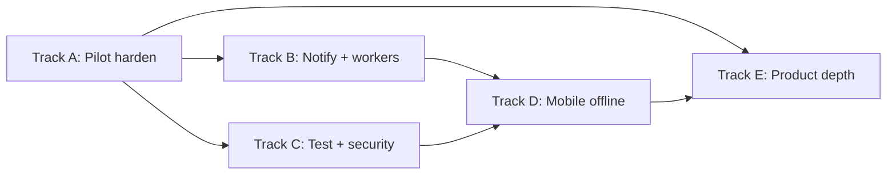

# ImpactFlow — Gaps & Polish Plan

Phases 1–8 delivered the product surface. What’s left is **pilot readiness**, then **depth**.

## Guiding principle

Ship a **pilot-ready core** first (auth polish, CI, deploy, tenant isolation tests, notifications, demo data). Defer surveys/RAG/offline until you have a first real org using the app.

---

## Track A — Pilot hardening (do first)

**Goal:** Safe to invite a real NGO onto a staging environment.

| # | Work item | Why | Outcome | Status |
|---|-----------|-----|---------|--------|
| A1 | **Change-password flow** | `must_change_password` exists; no endpoint/UI | `POST /auth/change-password` + forced change after invite/login | done |
| A2 | **Forgot / reset password** | No recovery path | Tokenized reset + web pages | done |
| A3 | **Invite polish** | Temp password returned in API only; `send_invite` unused | Optional email invite; never log secrets; audit on invite | done |
| A4 | **API key request auth** | Keys are CRUD-only; JWT-only in `deps.py` | Accept `X-Api-Key` / `Authorization: Bearer if_…`; scope checks; `last_used_at` | done |
| A5 | **Rate limiting** | Redis unused; login abuse risk | Redis rate limit on auth + public branding + AI endpoints | done |
| A6 | **Prod Compose / deploy docs** | Compose is reload/dev | `docker-compose.prod.yml`; README deploy section | done |
| A7 | **Demo seed CLI** | Empty orgs kill demos | `python -m app.scripts.seed_demo` | done |
| A8 | **Secrets hygiene** | Fernet can fall back to JWT-derived key | Fail startup in production if secrets are defaults | done |

**Exit criteria:** Staging deploy with HTTPS, invite → force password change → login MFA optional; demo dataset loads in one command.

---

## Track B — Notifications & background work

**Goal:** The platform *reacts* instead of only storing records.

| # | Work item | Outcome | Status |
|---|-----------|---------|--------|
| B1 | **Notification model** | `notifications` table: user, org, type, title, body, link, read_at | done |
| B2 | **In-app inbox UI** | Bell + `/app/notifications`; mark read | done |
| B3 | **Event emitters** | Emit on invite, task overdue, prediction opened, report published, integration error | done |
| B4 | **Email provider** | Abstract mailer (SMTP or Resend/SendGrid) | done |
| B5 | **Slack delivery** | Real outbound for Slack integrations | done |
| B6 | **Job runner** | Redis-backed worker for webhooks, overdue tasks, email | done |
| B7 | **Webhook deliveries** | Delivery log with retries + DLQ | done |

**Exit criteria:** Creating a prediction or publishing a report creates an in-app notification; Slack/email fire when configured.

---

## Track C — Quality, CI, security polish

**Goal:** Don’t break multi-tenancy or RBAC as you ship.

| # | Work item | Outcome | Status |
|---|-----------|---------|--------|
| C1 | **GitHub Actions** | PR: ruff + pytest + web lint/build | done |
| C2 | **Test DB fixture** | `conftest.py` with async DB + tenant helpers | done |
| C3 | **Critical API tests** | Cross-org denied; permissions; invite; API key auth | done |
| C4 | **Web smoke (Playwright)** | Login → dashboard → create program | done |
| C5 | **Fill empty tests** | Fix noop tests; platform/AI smoke | done |
| C6 | **Security checklist** | Prod CORS; OpenAPI off; audit coverage; no secrets in logs | done |
| C7 | **Health deepening** | `/ready` checks DB + Redis | done |

**Exit criteria:** PR cannot merge if API tests or web build fail; cross-tenant isolation tests per major module family.

---

## Track D — Mobile offline (field reality)

**Goal:** Field officers collect when connectivity is bad.

| # | Work item | Outcome | Status |
|---|-----------|---------|--------|
| D1 | **SQLite schema** | Local beneficiaries, households, communities, mutation queue | done |
| D2 | **Offline write path** | Create/edit locally with `sync_status: pending` | done |
| D3 | **Sync engine** | Push queue → API; pull deltas; server-wins v1 | done |
| D4 | **UX** | Online/offline banner; last sync; retry failed | done |
| D5 | **Auth resilience** | Refresh token handling when back online | done |

**Exit criteria:** Airplane mode → register beneficiary → reconnect → appears in web list.

---

## Track E — Product depth (after pilot)

| # | Work item | Status |
|---|-----------|--------|
| E1 | Surveys / dynamic forms | done |
| E2 | Real RAG (chunks + embeddings + ILIKE fallback) | done |
| E3 | MEAL / finance polish | done |
| E4 | White-label login + custom domain docs | done |
| E5 | UX polish (sidebar groups + empty states) | done |

### E1 — Surveys / dynamic forms
- Models: `Survey`, `SurveyVersion` (JSON schema), `SurveyResponse`
- Builder UI + field capture on web (`/app/surveys`)
- Optional: map Kobo/ODK imports into responses (deferred)

### E2 — Real RAG
- Chunk knowledge docs; portable embeddings (hash-v1 / OpenAI)
- Copilot retrieves by similarity; cite sources via knowledge ids
- Keep ILIKE fallback when no embeddings

### E3 — MEAL / finance polish
- Indicator dashboards (targets vs actuals)
- Evidence verification workflow
- Budget burn alerts via notifications
- Donor report pack export (Markdown/HTML)

### E4 — White-label / integrations polish
- Login page consumes `public/branding/{slug}`
- Custom domain docs + DNS checklist (`docs/CUSTOM_DOMAIN.md`)
- Integration OAuth beyond raw webhooks (deferred)
- API key scopes enforced per route group (v1 scopes already)

### E5 — UX polish (cross-cutting)
- Empty states component
- Sidebar grouping
- Favicon/branding from org settings when enabled (login wired)

---

## Suggested timeline (8 weeks, one engineer)

| Week | Focus |
|------|--------|
| 1 | A1–A4, A8 (auth + API keys + secrets) |
| 2 | A5–A7, C1–C2 (rate limit, demo seed, CI skeleton) |
| 3 | C3–C7 (tests + security) |
| 4 | B1–B4 (notifications + email) |
| 5 | B5–B7 (Slack + worker + webhooks) |
| 6 | A6 deploy staging + demo dry-run |
| 7–8 | D1–D5 **or** E1/E2 based on pilot feedback |

---

## Priority matrix

| Priority | Tracks |
|----------|--------|
| **P0 — before any external pilot** | A (all), C1–C3, C6, A7 demo seed |
| **P1 — during first pilot** | B (notifications), A6 staging, UX empty states |
| **P2 — field expansion** | D mobile offline |
| **P3 — differentiation** | E surveys, RAG, donor packs, OAuth |

---

## Explicit non-goals (for now)

- Full Salesforce-parity CRM
- Multi-region active-active
- Billing/subscriptions
- Native iOS/Android outside Expo

---

## Definition of “pilot ready”

- [ ] Staging URL with HTTPS and non-default secrets
- [ ] Invite → change password → use app
- [ ] Demo org seeds in one command
- [ ] CI green on main
- [ ] Cross-tenant isolation tests pass
- [ ] In-app notifications for at least 2 events
- [ ] API keys can call a documented read endpoint
- [ ] `.env` never in git; deploy docs for web + API + Postgres

---

## Inventory notes (as of Epic 6 / API 0.18)

**Exists:** Full A–E stack, Epics 1–5, plus Epic 6 Integrations Hub (`docs/EPIC6_INTEGRATIONS_HUB.md`): connector registry, encrypted credentials, sync jobs, field mapping, inbound webhooks + DLQ redrive, developer portal, plugin/marketplace foundation, monitoring dashboard.

**Deferred:** Live OAuth token exchange, scheduled Kobo/ODK worker pulls, GraphQL, Twilio/WhatsApp send, native PDF engine.
